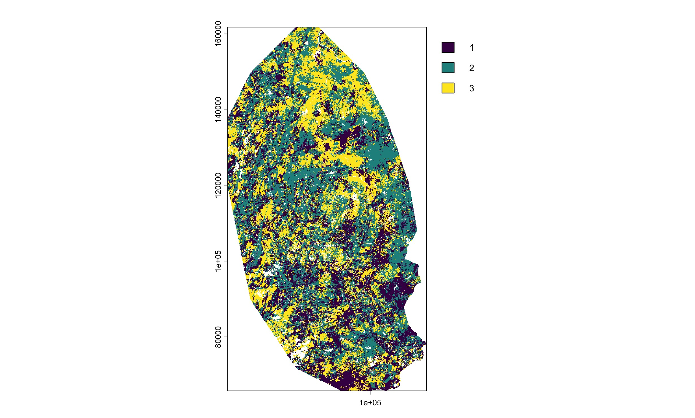
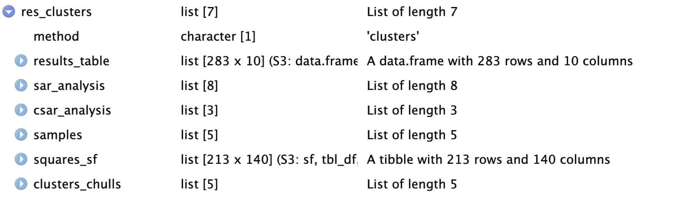
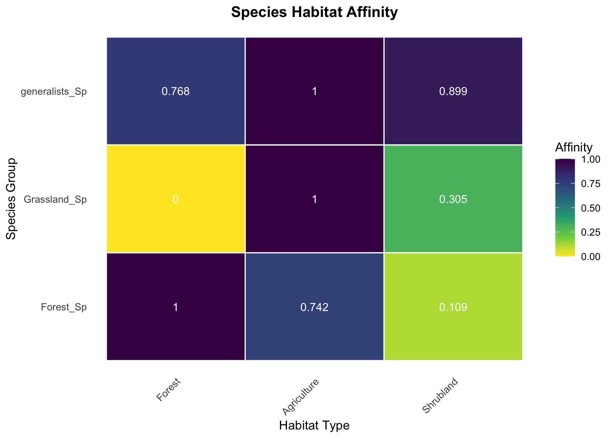

Analyze binary species occurrence and classification data with a SAR or a cSAR analysis based on a nested or hierarchichal sampling design.

csarGeo allows an advances SAR- and cSAR-analysis to assess biodiversity changes in structurally diverse landscapes. The cSAR analysis function can account for habitat affinity differences across multiple species groups beyond

The package contains an associated vignette with detailed example usages for both of the available analysis methods. For further information regarding the background of countrysideSAR analyses, the papers of ... (pereira, martins)

# Table of Contents

-   [Package Installation](https://github.com/lillyschwietzer/csarGeo/tree/main#1-installation)

-   [Example Analysis](https://github.com/lillyschwietzer/csarGeo/tree/main#2-example-analysis)

-   [References](https://github.com/lillyschwietzer/csarGeo/tree/main#3-references)

# 1. Installation

## 1.1) csarGeo Package

Install package from GitHub:

```{r}
library(pak)

pak("lillyschwietzer/csarGeo")
library(csarGeo)
```

## 1.2) csarGeo Package Data

The package contains three different default data files. One that contains species occurence data and sampling location coordinate information:

```{r}
data("species_data")
head(species_data)
# A tibble: 213 × 120
#   location   long     lat `accipiter gentilis` `accipiter nisus` `actitis hypoleucos` `aegithalos caudatus`
#   <chr>     <dbl>   <dbl>                <dbl>             <dbl>                <dbl>                 <dbl>
# 1 pe48m    71411.  92852.                    0                 0                    0                     0
# 2 pe48r    73396.  90836.                    0                 0                    0                     1
# 3 pe48t    73427.  94836.                    0                 0                    0                     0
# 4 pe48x    75411.  92821.                    0                 0                    0                     0
# 5 pe49k    71458.  98852.                    0                 0                    0                     0
# 6 pe49t    73505. 104836.                    0                 0                    0                     0
# 7 pe56p    81287.  76775.                    0                 0                    0                     0
# 8 pe56t    83271.  74759.                    0                 0                    0                     0
# 9 pe56x    85255.  72744.                    0                 0                    0                     0
#10 pe56z    85286.  76744.                    0                 0                    0                     0
# ℹ 203 more rows
# ℹ 113 more variables: `aegypius monachus` <dbl>, `alauda arvensis` <dbl>, `alcedo atthis` <dbl>,
#   `alectoris rufa` <dbl>, `anas platyrhynchos` <dbl>, `anthus campestris` <dbl>, `anthus pratensis` <dbl>,
#   `apus apus` <dbl>, `aquila chrysaetos` <dbl>, `ardea cinerea` <dbl>, `athene noctua` <dbl>, `bubo bubo` <dbl>,
#   `burhinus oedicnemus` <dbl>, `buteo buteo` <dbl>, `calandrella brachydactyla` <dbl>,
#   `carduelis carduelis` <dbl>, `carduelis spinus` <dbl>, `cecropis daurica` <dbl>, `certhia brachydactyla` <dbl>,
#   `cettia cetti` <dbl>, `charadrius dubius` <dbl>, `chloris chloris` <dbl>, `ciconia ciconia` <dbl>, …
# ℹ Use `print(n = ...)` to see more rows, and `colnames()` to see all variable names
```

One species classification file:

```{r}
data("classes_clusters")
head(classes_clusters)
# A tibble: 6 × 6
#  species               Forest_Sp Shrub_Sp Grassland_Sp generalists_Sp other_specialists_Sp
#  <chr>                     <dbl>    <dbl>        <dbl>          <dbl>                <dbl>
#1 galerida sp.                  0        0            0              1                    0
#2 columba palumbus              1        0            0              0                    0
#3 erithacus rubecula            0        0            0              1                    0
#4 curruca melanocephala         0        1            0              0                    0
#5 cyanopica cooki               1        0            0              0                    0
#6 oriolus oriolus               1        0            0              0                    0
```

And one SpatRaster land-use file. The latter is a release of the package and may be loaded using a helper function of the csarGeo package called `load_rasterfile()`:

```{r}
library(csarGeo)
library(terra)

# SpatRaster Data
land_use <- load_rasterfile()
plot(land_use)
```



# 2. Example Analysis

The example below only contains information regarding the the analysis method "clusters", which is one of two possible pathways of the csarGeo package. For a detailed explanation as well as examples of both pathways, please consult the vignette.

## 2.1) Analysis Function countryside_sar()

```{r}
res_cl <- countryside_sar(
  data = species_data,
  method = "clusters",
  square_size = 2000,
  cluster_sizes = c(1, 4, 16, 64, 256),
  habitat = land_use,
  habitat_names = c("Forest", "Agriculture", "Shrubland"),
  classification = classes_clusters,
groups = c("Forest_Sp", "Grassland_Sp", "generalists_Sp")
)
```

{width="Infinity"}

## 2.2) Visualization Function visuals_sar()

Visuals_sar() offers three possible plot options: "map", "sar" and "csar".

```{r}
visuals_sar(res_cl, plot_type = "map")
```

```{r}
visuals_sar(res_cl, plot_type = "sar")
```

```{r}
visuals_sar(res_cl, plot_type = "csar")
```



# 3. References
