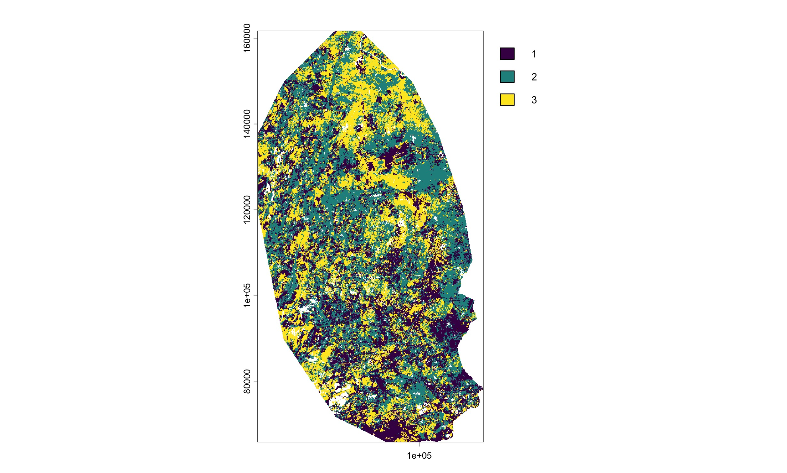
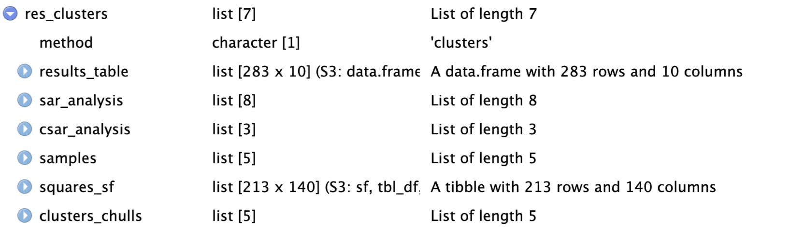

**csarGeo** enables advanced Species-Area Relationship (SAR) and countryside SAR (cSAR) analysis to assess biodiversity changes in structurally diverse landscapes using binary species occurrence and classification data. It can reveal both the species-area relationship and habitat affinity differences across multiple species groups.

A detailed vignette with examples for both analysis methods is included. For background on the countrysideSAR model and different sampling approaches, see the References section.

# Table of Contents

- [Installation](https://github.com/lillyschwietzer/csarGeo/tree/main#1-installation)

- [Example Analysis](https://github.com/lillyschwietzer/csarGeo/tree/main#2-example-analysis)

- [References](https://github.com/lillyschwietzer/csarGeo/tree/main#3-references)

# 1. Installation

## 1.1) csarGeo Package

Install directly from GitHub using the `pak` package:

```{r}
library(pak)

pak("lillyschwietzer/csarGeo")
library(csarGeo)
```

## 1.2) csarGeo Package Data

The package contains three different default datasets: "**species_data**", "**classes_clusters**" and a land-use SpatRaster. These can be used for example analyses and as a reference for the required input data structure.

- **species_data**

Binary species occurrence data with coordinates for sampling locations:

```{r}
data("species_data")
head(species_data)
# A tibble: 213 × 120
#   location   long     lat `accipiter gentilis` `accipiter nisus` `actitis hypoleucos` `aegithalos caudatus`
#   <chr>     <dbl>   <dbl>                <dbl>             <dbl>                <dbl>                 <dbl>
# 1 pe48m    71411.  92852.                    0                 0                    0                     0
# 2 pe48r    73396.  90836.                    0                 0                    0                     1
# 3 pe48t    73427.  94836.                    0                 0                    0                     0
# 4 pe48x    75411.  92821.                    0                 0                    0                     0
# 5 pe49k    71458.  98852.                    0                 0                    0                     0
# 6 pe49t    73505. 104836.                    0                 0                    0                     0
# 7 pe56p    81287.  76775.                    0                 0                    0                     0
# 8 pe56t    83271.  74759.                    0                 0                    0                     0
# 9 pe56x    85255.  72744.                    0                 0                    0                     0
#10 pe56z    85286.  76744.                    0                 0                    0                     0
# ℹ 203 more rows
# ℹ 113 more variables: `aegypius monachus` <dbl>, `alauda arvensis` <dbl>, `alcedo atthis` <dbl>,
#   `alectoris rufa` <dbl>, `anas platyrhynchos` <dbl>, `anthus campestris` <dbl>, `anthus pratensis` <dbl>,
#   `apus apus` <dbl>, `aquila chrysaetos` <dbl>, `ardea cinerea` <dbl>, `athene noctua` <dbl>, `bubo bubo` <dbl>,
#   `burhinus oedicnemus` <dbl>, `buteo buteo` <dbl>, `calandrella brachydactyla` <dbl>,
#   `carduelis carduelis` <dbl>, `carduelis spinus` <dbl>, `cecropis daurica` <dbl>, `certhia brachydactyla` <dbl>,
#   `cettia cetti` <dbl>, `charadrius dubius` <dbl>, `chloris chloris` <dbl>, `ciconia ciconia` <dbl>, …
# ℹ Use `print(n = ...)` to see more rows, and `colnames()` to see all variable names
```

- **classes_clusters**

Binary classification data assigning species to habitat groups:

```{r}
data("classes_clusters")
head(classes_clusters)
# A tibble: 6 × 6
#  species               Forest_Sp Shrub_Sp Grassland_Sp generalists_Sp other_specialists_Sp
#  <chr>                     <dbl>    <dbl>        <dbl>          <dbl>                <dbl>
#1 galerida sp.                  0        0            0              1                    0
#2 columba palumbus              1        0            0              0                    0
#3 erithacus rubecula            0        0            0              1                    0
#4 curruca melanocephala         0        1            0              0                    0
#5 cyanopica cooki               1        0            0              0                    0
#6 oriolus oriolus               1        0            0              0                    0
```

- **SpatRaster** file

Contains land-use information. Load it using the helper function `load_landuse()`:

```{r}
library(csarGeo)
library(terra)

# SpatRaster Data
land_use95 <- load_landuse()
terra::plot(land_use95)
```



## 1.3) csarGeo Vignette

The package includes the vignette `"intro_csarGeo"`, which provides detailed background on the methodology, the internal workflow of the `countryside_sar()` function, its two analysis pathways, and the output structure.

To install the package with its vignette:

```{r}
library(devtools)

devtools::install_github("lillyschwietzer/csarGeo", 
                         build_vignettes = TRUE,
                         force = TRUE)

vignette("intro_csarGeo")
```

# 2. Example Analysis

The example below demonstrates the **"clusters"** analysis method, one of two pathways available in the package. For detailed explanations and examples of both pathways (`"circles"` and `"clusters"`), please consult the vignette.

## 2.1) Analysis Function countryside_sar()

```{r}
res_cl <- countryside_sar(
  data = species_data,
  method = "clusters",
  square_size = 2000,
  cluster_sizes = c(1, 4, 16, 64, 256),
  habitat = land_use95,
  habitat_names = c("Forest", "Agriculture", "Shrubland"),
  classification = classes_clusters,
groups = c("Forest_Sp", "Grassland_Sp", "generalists_Sp")
)
```

{width="Infinity"}

## 2.2) Visualization Function visuals_sar()

The second function, `visuals_sar()`, offers three possible plot options for the results of `countryside_sar()`:

- "map" - Map of all clustering levels

- "sar" - Species-area-relationship plot

- "csar" - species habitat affinity heatmap

```{r}
# Map of all cluster levels
visuals_sar(res_cl, plot_type = "map")

# SAR plot
visuals_sar(res_cl, plot_type = "sar")

# Species affinity heatmap
visuals_sar(res_cl, plot_type = "csar")
```

# 3. References

Inês S. Martins u. a., „Alternative pathways to a sustainable future lead to contrasting biodiversity responses“, Global Ecology and Conservation 22 (Juni 2020): e01028, <https://doi.org/10.1016/j.gecco.2020.e01028>.

Martins, I., Pereira, H.M. Improving extinction projections across scales and habitats using the countryside species-area relationship. Sci Rep 7, 12899 (2017). <https://doi.org/10.1038/s41598-017-13059-y>

Scheiner, Samuel. (2003). Six Types of Species-Area Curves. Global Ecology and Biogeography - GLOBAL ECOL BIOGEOGR. 12. 10.1046/j.1466-822X.2003.00061.x.
