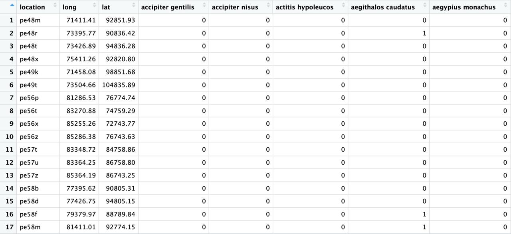
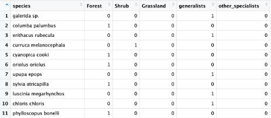
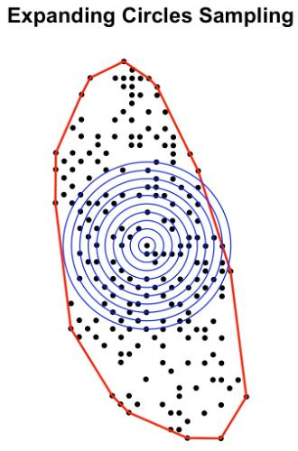
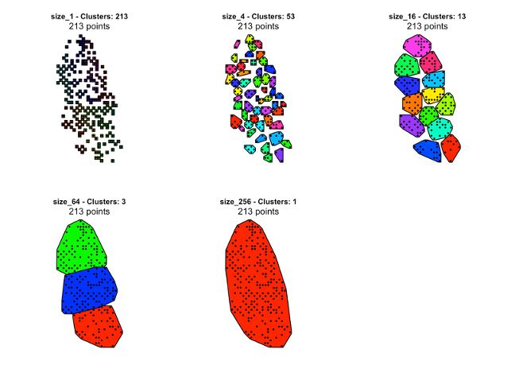

This vignette offers a detailed introduction to the csarGeo package. Its aim is to familiarize you with the necessary structure of the input data, provide an overview of the workflow of both the countryside_sar and the visuals_sar function, as well as providing an overview of the influence of your data, specifically of the evenness of sampling locations, on the accuracy of the analysis function countryside_sar.

# 1. Input Data

## 1.1 Input Files: Species Data, Raster- and Species Class File

The **species data table** needs a location ID as the first column, the longitude and latitude values as its second and third columns and binary presence-absence species data from column 4 and onward (s. figure 1). The function receives this table as the parameter "data".



The function further requires a **spatial raster file** of the sampling locations for the parameter "habitat" (s. figure 2) and finally a **classification file** for the parameter "classification" (s. figure 3). The classification file contains the species name as the first column and binary classification columns


{width="532"}

If you choose to import a custom hull as the analysis area, make sure both the raster file and the hull use the same coordinate reference system (CRS)

## 1.2 Coordinate Data and Projection

If your coordinate data uses a geographic coordinate system, you can either rely on the auto-detection and -transformation of the csarGeo function to UTM projected coordinates, or you can use the target_crs option to transform your geographic coordinates into a suitable projection, which is advised if the data includes edge cases like polar or equatorial regions (Kumar et al., 2023).

## 1.3 Considerations: Data Input

Per design the csarGeo function is most suitable for datasets of large areas with evenly distributed sampling locations

# 2. Workflow

To begin, the function combines the latitude and longitude column data into one coordinate column for each location. To assure proper transformation, make sure you are aware of the projection of the latitude and longitude of your data as per 1.2.

It then continues with one of two possible analysis pathways: either "circles" or "clusters". Method "circles" performs a randomized sampling of datapoints in expanding circles within a polygon hull. For this it either uses an imported hull (parameter "custom_hull") or auto-generates a hull if none is provided. The second method "clusters"

It's possible to run the function multiple times using the parameter "n_runs" when using the method "circles". This option is not available for "clusters" as it is deterministic:

Out of all datapoints one is selected randomly

around all datapoints , while "clusters" samples different levels of proximity based sampling location clusters

Both methods then aggregate the sampled species data. In case of "circles" that

It begins at a randomly selected starting point and starts sampling in circles around this point.

```{r}
res <- csarGeo(
  data = data,   # input data
  crs = 3763,     # coordinate reference system of input data and land use raster 'habitat'
  method = "circles",
  radius = 2000 * 1:10, # function samples: 2000 units wide circles 10 times
  habitat = lu1995,
  habitat_names = c("Forest", "Agriculture", "Shrubland"),
  habitat_codes = 1:3,
  classification = classif,
  n_runs = 2)  # number of runs
```

This example would generate a

It's also possible to use this method for multiple runs. This doesn't work for "clusters"

or a proximity based sampling of points in clusters of increasing extends at each level.

As its last step it executes a SAR analysis by fitting the aggregated sampling data of either method with a simple log-log scaled linear model.

```{r}
test_clusters <- countryside_sar2(
  data = data,
  crs = 3763,
  method = "clusters",
  square_size = 2000,
  cluster_sizes = c(1, 4, 16, 64, 256),
  habitat = lu1995,
  habitat_names = c("Forest", "Agriculture", "Shrubland", "Other"),
  habitat_codes = c(1, 2, 3, 4),
  classification = classif,
  groups = NULL
)
```

## 2.1 Method: Circles

{width="203"}

Prior to sampling, countryside_sar wraps a hull around all sampling locations (either an imported hull or an auto-generated one) and randomly selects one point to begin sampling. It then samples species and coordinate data

The function stops sampling by default if more than 50 % of the area of a circular vector lie outside of the hull boundary. If needed, this can be adjusted using the parameter "break_threshold" ranging from 0 (function continues regardless of how much of the circle lies outside of the hull) to 1 (the function breaks off immediately if any part of the circle lies outside of the hull).

Based on a randomly selected point from the data, the function samples in stepwise expanding circles.

For each circle it saves:

Aggregation

## 2.2 Method: Clusters



Each level of the clusters method groups sampling locations and their species data. The first level assigns a group to each sampling location, the last group includes all locations in one cluster. The clustering of samples is proximity-based

Aggregation

## 2.3 Linear Model and SAR Analysis

# 3. Visualization using visuals_sar

The visuals_sar function does not add any further analysis and only serves as a quick way to plot the results of csarGeo and as such only includes the absolute minimum of possible plot modifications.

# 4. References

Kumar, M., Singh, R.B., Singh, A., Pravesh, R., Majid, S.I., Tiwari, A. (2023). Referencing and Coordinate Systems in GIS. In: Geographic Information Systems in Urban Planning and Management. Advances in Geographical and Environmental Sciences. Springer, Singapore. <https://doi.org/10.1007/978-981-19-7855-5_2>
