This vignette offers a detailed introduction to the **csarGeo** package. Its aim is to familiarize you with the necessary structure of the input data and to provide an overview of the workflow of both the countryside_sar() and the visuals_sar() function. Further it will explain the influence of your data, specifically of the evenness of sampling locations, on the accuracy of the analysis function countryside_sar() to ensure optimal utilization.

## Prior To Using The Package

The csarGeo package was created to offer a short and bundled option for an advanced SAR-analysis that offers the ability to analyse biodiversity changes in structurally diverse landscapes while accounting for habitat affinity across multiple species groups. As suggested in previous studies, classic SAR models tend to overestimate species extinction rates due to their inherent assumption of species-extinction given a non-native habitat. In contrast cSAR models assume possible persistence even in human-modified habitats under different habitat affinities (Martins et al., 2017, Martins et al., 2020). Countryside-SAR models therefore offer a potentially powerful analysis tool for biodiversity changes and the csarGeo package provides an option to analyze data in this manner with only one function, **countryside_sar()** as well as a quick way to create base plots of the results with **visuals_sar()**.

However in order to use this package to its full power, the user should be aware of potential limitations of the analysis method and the influence of the input data. Per design the countryside_sar() function is most suitable for datasets of intermediate extents with spatially balanced, evenly distributed sampling locations (s. Fig. 1). Locally clustered sampling locations, especially in the outer perimeter of the sampling area, may cause an early sampling stop in case of the first method, "circles". Not only will the random selection of the first sampling point result in a high probability of choosing a similar location to begin sampling over and over again if many sampling locations are clustered in a certain area of the map, it further includes a break-protocol that activates once a defined proportion (50 % by default) of the circular sampling vector lies outside of the sampling area. If your sampling locations occupy corners of your sampling area very often, the function is likely to stop sampling very early. As for the second analysis pathway "clusters" the function classifies different sampling locations in hierarchical groups based on their proximity to one another. Because of that, large distances between sampling locations cause great jumps of cluster extents from one level to the next. Both of these pathways are explained in detail under 2.1 and 2.2. A high-resolution land-use raster further increases the accuracy of the pixel-based calculation of the habitat areas and minimizes edge effects around the polygons.

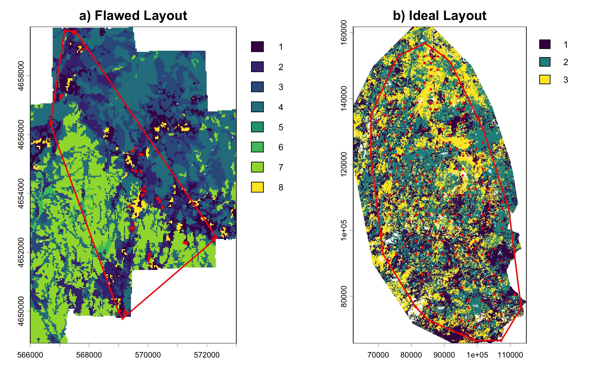

# 1. Input Data

## 1.1 Input Files: Species Data, Raster- and Species Class File

Due to its

The **species data table** needs a location ID as the first column, the longitude and latitude values as its second and third columns and binary presence-absence species data from column 4 and onward (s. example using default data of csarGeo). The function receives this table as the parameter "data".

```{r}
#data("species_data")
#head(species_data)
```

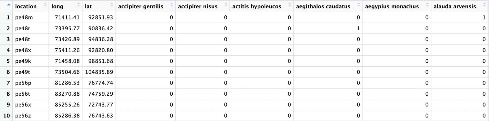{width="699"}

The function further requires a **spatial raster file** of the sampling locations for the parameter "habitat" (s. figure 2) and finally a **classification file** for the parameter "classification" (s. figure 3). The classification file should contain the species name as the first column and a binary classification to habitat affinities from column 2 and onward (s. figure 3). It is not necessary to mind upper- and lowercase letters for the species names as the function defaults all names to lowercase to account for formatting errors.


```{r}
#data("classes_clusters") # example species classification 
#head(classes_clusters)
```

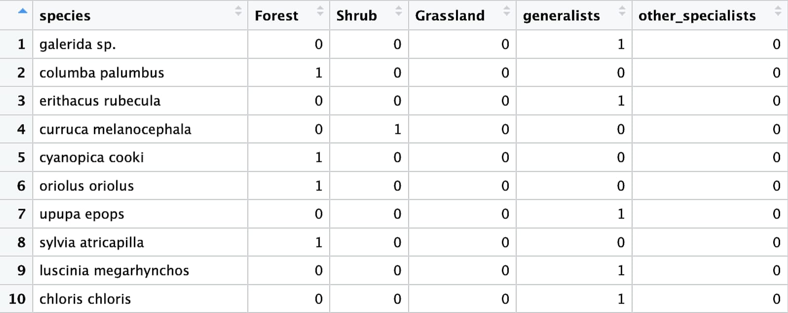{width="583"}

If you choose to import a custom hull using 'custom_hull' for the analysis area, make sure both the raster file and the hull use the same coordinate reference system (CRS).

## 1.2 Coordinate Data and Projection

If your coordinate data uses a geographic coordinate system, you can either rely on the auto-detection and -transformation of the countryside_sar function to UTM projected coordinates, or you can use the target_crs option of the function to transform your geographic coordinates into a suitable projection, which is advised if the data includes edge cases like polar or equatorial regions (Kumar et al., 2023).

# 2. Workflow

The countryside_sar function offers a quite overwhelming choice of possible parameters. To help you along, this section aims to familiarize you with the general workflow of the function and explain the difference between the two main analysis pathways "circles" and "clusters". Examples of calls for both pathways are provided in section 5.

## 2.1 General Workflow

To begin, and regardless of your method of choice, the function combines the latitude and longitude column data into one coordinate column for each location. To assure proper transformation, make sure you are aware of the projection of the latitude and longitude of your data as per 1.2.

It then continues with one of two possible analysis pathways: either "circles" or "clusters". Method "circles" samples data-points in expanding circles within a polygon hull, beginning with a randomly selected sampling point. "Clusters" executes a step-wise proximity based grouping of sampling locations from singular sampling units up to the entire sampling area. While the method differs, both sample species data and locations, which are then used to aggregate species occurrence data as well as habitat and total area.

As its last step countryside_sar() executes a SAR analysis by fitting the aggregated species and area data of either method with a simple log-log scaled linear power model and, in case of "clusters", a countryside SAR analysis as well.

## 2.2 Method: Circles

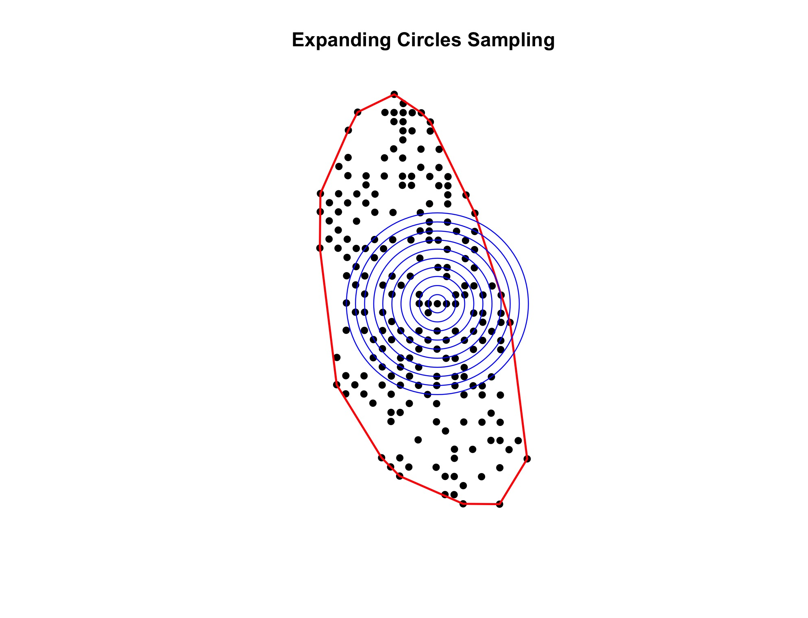{width="585"}

The **expanding circles sampling** is one of two possible sampling methods of the function `countryside_sar()`. Prior to sampling, the function wraps a hull around all sampling locations, indicated in red in figure 3. The function may use a hull imported via the custom_hull parameter or it will auto-generate one. Then one of the sampling locations within the hull is chosen randomly as the first sampling point. In step-wise expanding circles, the function then samples species- and coordinate data for every defined radius and then aggregated for each circle: the area of each habitat, the total area, the species richness of each species group, the total species richness and the total polygon area.

The function stops sampling by default if more than 50 % of the area of a circular vector lie outside of the hull boundary. If needed, this can be adjusted using the parameter 'break_threshold' ranging from 0 (function continues regardless of how much of the circle lies outside of the hull) to 1 (the function breaks off immediately if any part of the circle lies outside of the hull).

By defining the values of the vector for "radius", the user can choose the number of samplings done per iteration as well as the extent of each round (round as defined by

To use the first pathway, "circles", the user may use the following parameters:

The parameters described in 1) are non-optional and have to be defined by the user in order to run countryside_sar(). The parameters of 2) are optional and allow modifications such as the import of a polygon hull for the sampling area, define the desired species groups for analysis (otherwise the function analyses all species groups of the classification file), CRS transformation and the possibility to run the function multiple times using the parameter "n_runs". This option is not available for "clusters" as it is deterministic.

A full analysis example is provided in 5.1.

| Parameter | Description | Necessary |
|-----------------|---------------------------------------|-----------------|
| data | binary species data and sampling location latitude and longitude | Non-optional |
| method | defines "circles" as sampling method | Non-optional |
| radius | Defines the radius size as well as the total amount of circles for method: "Circles" | Non-optional |
| habitat | Land-use raster .tif of the sampling location | Non-optional |
| habitat_names | Character vector with the names of the land-use types of the land-use raster defined in 'habitat'. | Non-optional |
| classification | Species classification file. A table with a first column for species names and the following columns as binary (0/1) group indicators. | Non-optional |
| n_runs | Number of iterations, default n_runs = 1 | Non-optional |
| break_threshold | Initiates break-protocol for method "Circles" based on the proportion of the circular vector that lies inside the convex hull. E.g. break_threshold = 0.9 -\> if less than 90 % of the circle lies inside of the hull, stop. Defaults to 0.5 | Optional |
| custom_hull | Import a polygon hull for method "circles". If method = "clusters" the function will ignore the imported hull and auto-generate a hull instead. If custom_hull = NULL, the function auto-generates a hull for method "circles". | Optional |
| groups | Species groups to use for analysis, defaults to NULL, the function will use all groups available in classification file | Optional |
| seed | Optional seed for reproducibility | Optional |

## 2.3 Method: Clusters

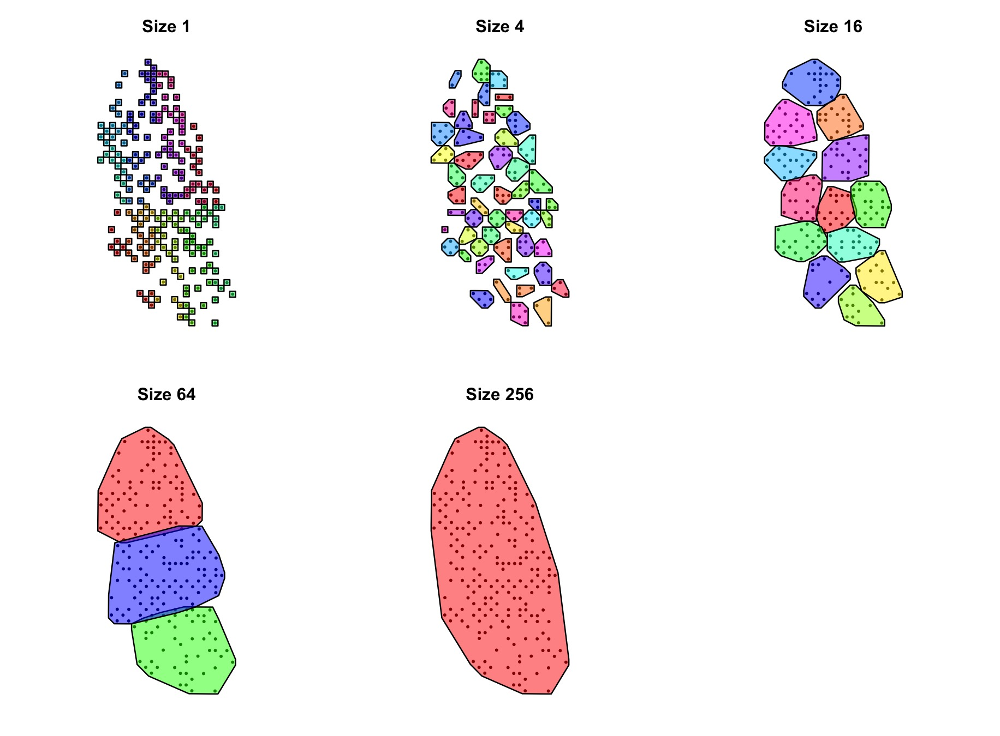

In contrast to "circles", the analysis of "clusters" is deterministic: it always begins with every individual sampling location as a cluster unit and ends with one final cluster that entails all sampling locations. The clustering of samples is proximity-based and saves species occurrence data of the sampling locations within each cluster, as well as geometry data of the polygon around the cluster. It is not possible to import hulls in the same manner as for circles, every polygon is auto-generated.

Each level of the clusters method groups sampling locations and their species data. The first level assigns a group to each sampling location, the last group includes all locations in one cluster.

Aggregation

For this analysis pathway, countryside_SAR offers and needs the following parameters:

| Parameter | Description | Necessary |
|---------------|-------------------------------------------|---------------|
| data | binary species data and sampling location latitude and longitude | Non-optional |
| method | defines "clusters" as sampling method | Non-optional |
| square_size | The size of the square buffer for each sampling point for method "Clusters". | Non-optional |
| cluster_sizes | Numerical vector that defines the amount of levels for the hierarchical "Clusters" approach as well as the amount of clusters within each level, e.g. c(1, 4, 16, 64, 256) -\> 5 levels, first level 256 clusters, second level 64 clusters, etc. | Non-optional |
| habitat | Land-use raster of the sampling location, a .tif file. | Non-optional |
| habitat_names | Character vector with the names of the land-use types of the land-use raster defined in 'habitat'. | Non-optional |
| classification | Species classification file. A table with a first column for species names and the following columns as binary (0/1) group indicators. | Non-optional |
| groups | Which group columns to use from classification (NULL = use all columns except first). Defaults to NULL. | Optional |

## 2.4 Classic SAR and cSAR Analysis

Despite its name, the countryside_sar function offers two possible models for the sampled species data: a **classic SAR analysis** and a **countryside SAR analysis (cSAR)**, both of which use the sars package as well as the aggregated data from either the circles or the clusters pathway. While the classic SAR is available for both analysis pathways, the cSAR analysis is only possible using method clusters.

Due to its nested design, circles produces sampling data with high spatial autocorrelation. Further, the step-wise increase of the sampling circles produce a table with varying spatial data, but offers no way to differentiate the habitat quality of the sampled area in a general context. By running circles multiple times, it is possible to produce a usable SAR analysis via the average of all individual SAR results, but due to the overlap between the runs, multiple runs cannot be used in the same manner as multiple hierarchical levels of method clusters to run a cSAR analysis. The latter allows for the discrimination of habitat quality alongside spatial variance: the cSAR analysis does not simply compare the species richness of each cluster within each level, it also compares the habitat mosaics of all the clusters within a hierarchical level to assess the habitat affinity of each species group to the available habitats. In contrast, the classic SAR only projects the species richness depending on the total area available, the habitat qualities do not matter here.

For the classic SAR analysis and based on the species-area-relationship model of

$$
S = c * A^z
$$

where *S* is species richness, *A* is the sampled area, *z* is the species accumulation rate (slope), and *c* is the species richness at unit area (intercept). The function fits a log-log scaled standard linear regression model to the sampled species data, which is defined as:

$$
log(S) = log(c) + z * log(A)
$$

This classic model approach assumes that all habitat types contribute equally to species richness, effectively treating the landscape as homogeneous.

The cSAR model extends the classic SAR formula by replacing the total area A with a habitat-weighted area sum using

$$
S_i(A_1, A_2, \ldots, A_n) = c_i \left( \sum_{j=1}^{n} h_{ij} A_j \right)^z
$$

where *n* is the number of habitat types, *h* ~*ij*~ is the affinity of the species group *i* to habitat *j*, *A* ~*j*~the area of habitat *j*, and *c* ~*i*~ measures the relative local abundance of each species group *i* (Martins and Pereira, 2017)

As with the classic SAR, S is the species richness of the group and z the species accumulation rate (slope).

The detailed difference between both SAR models is described in *Matthews, sars package vignette*,

# 3. Output

The output of both methods is almost identical. Both are a large list that includes a **results table**, which holds the aggregated species data for either each circle or each cluster, the **results of the standard SAR and cSAR analysis** with the corresponding model data, a list with the **samples** of each sampling occurrence, both binary species data for each level as well as the polygon used to sample the data of this particular level (either a circle or the polygon around a cluster) and a list with the **sf transformed input species data** (points_sf for "circles" and squares_sf for "clusters") with the added coordinate column of each sampling location (s. 2.1 General Workflow). As for "circles" the output includes information about the polygon hull that defines the sampling area within **convex_hull**, "clusters" on the other hand holds information about the polygon around the clusters of each level in **clusters_chulls**.

To manually inspect both results table structures, please consult the provided examples in 5.

## 3.1 Circles

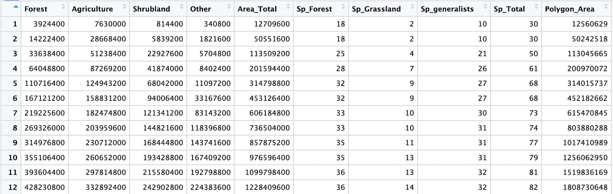{width="636"}

## 3.2 Clusters

The output of "clusters" is not nested as it can only contain the results of a single run. Outside of that, the general structure is the same as the one of "circles".

{width="499"}

The results_table contains the aggregated species data. Be mindful as the rows are continuous, therefore all clustering levels follow one another without

Aside from the columns for the area of each habitat type, two columns relate to areas: Area_Total, which is the aggregated sum of the calculated area based on the rasters resolution and Polygon_Area, which is the area of the polygon around a cluster. Ideally, the values of these columns are very similar. Use this as a control to make sure the function doesn't over- or underestimate the habitat areas.

# 4. Visualization using visuals_sar

The visuals_sar function does not add any further analysis and only serves as a quick way to plot the results of the countryside_sar function. As such it only includes the absolute minimum of possible plot modifications of both a map for the sampling layout as well as the results of the SAR analysis. The user can of course always plot these results using their own methods.

## 4.1 Map Plot

### 4.1.1 Circles

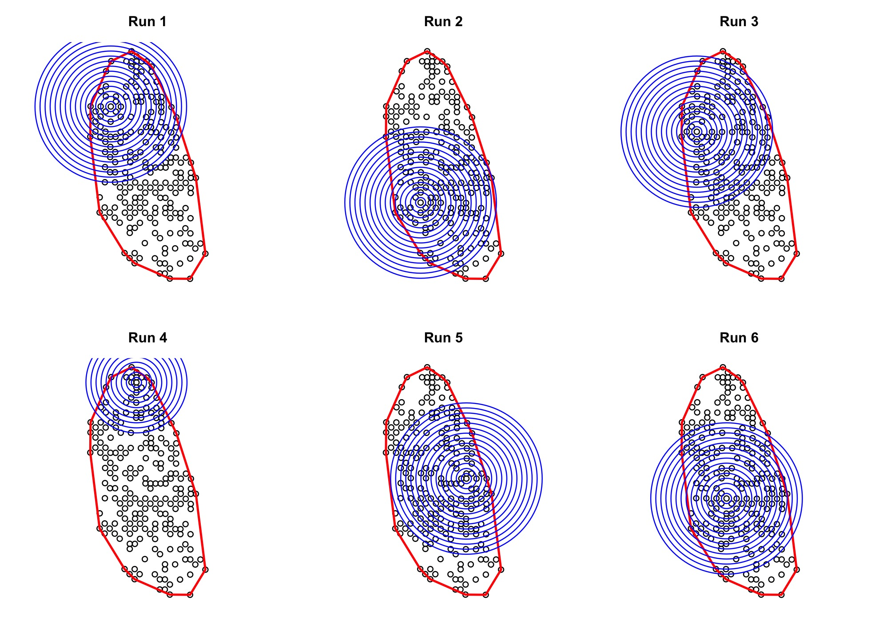

Using

```{r}
#visuals_sar(res, plot_type = "map")
```

a grid of all sampling maps with the corresponding run number can be created. To plot only one specific run, use:

```{r}
#visuals_sar(res, plot_type = "map", plot_all_runs = FALSE, plot_run_n = 3)
```

### 4.1.2 Clusters


In the same manner as for a result of method circles, a map that displays a plot for each hierarchical level of a clusters analysis may be called using:

```{r}
#visuals_sar(res, plot_type = "map")
```

## 4.2 SAR Plot

### 4.2.1 Base SAR Circles

Visuals_sar offers two different ways to plot the results of the classic SAR model: either the plots of each individual run or the average SAR result.

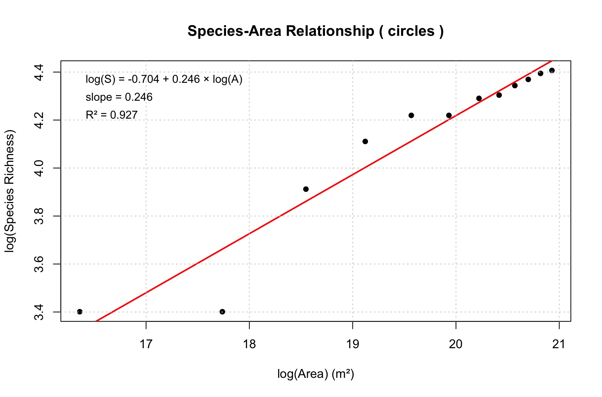{width="620"}

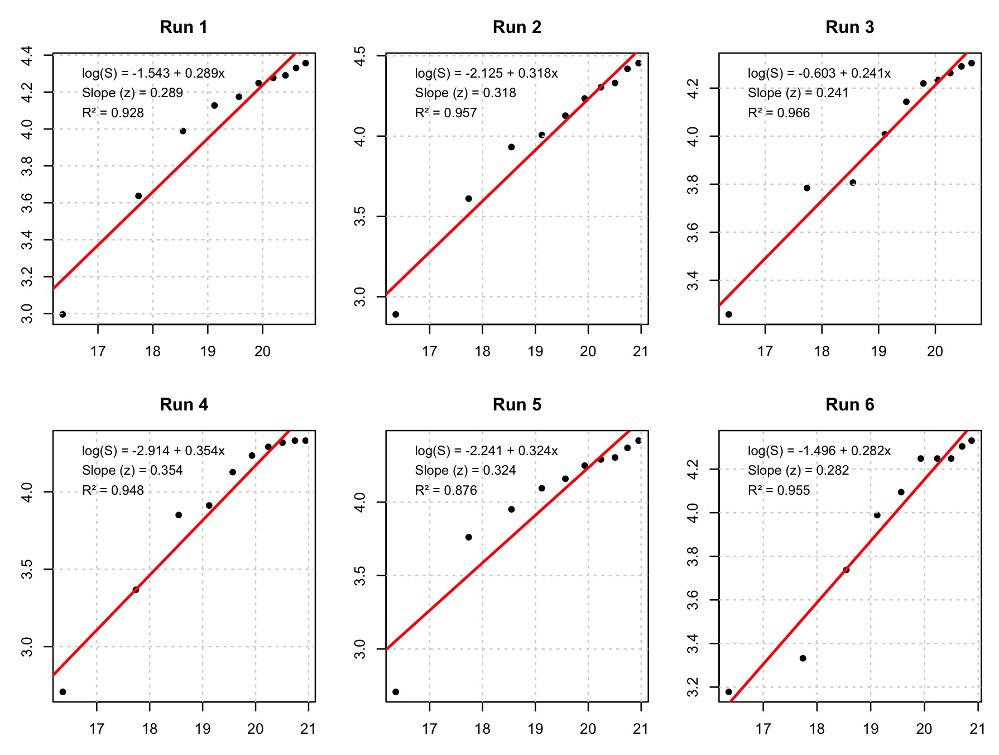


## 4.2.2 Base SAR Clusters

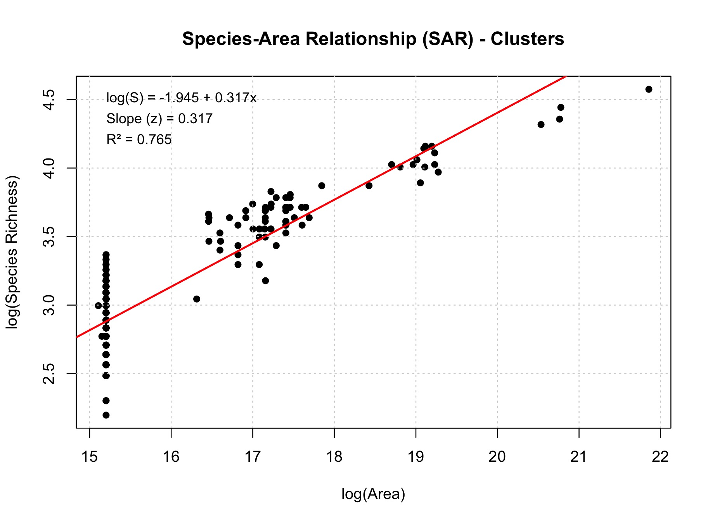

### 4.2.3 Countryside SAR

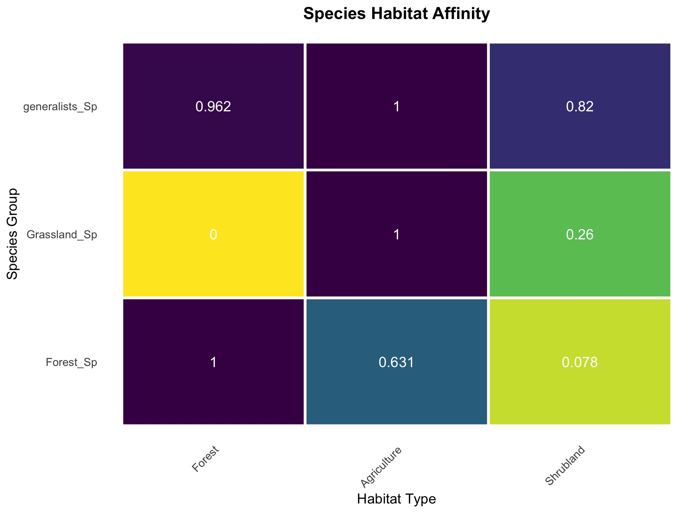

The affinity data of the cSAR analysis are visualized using a heatmap. It displays the affinities of the species groups to the different habitat types, 1 being a high affinity, 0 meaning no affinity towards the habitat type at all. The full model summary can be called using:

```{r}
#result[["csar_analysis"]][["model"]]
```

# 5. Examples: Full Analysis

The csarGeo package contains three files that may be used to run the analysis examples of 5.1 and 5.2.

```{r}
library(csarGeo)

data("species_data")
data("classes_clusters")

land_use <- load_lu1995()
```

## 5.1 Circles

```{r}
res_ci <- countryside_sar(
  data = data,
  method = "circles",
  radius = 2000 * 1:10,
  habitat = lu1995,
  habitat_names = c("Forest", "Agriculture", "Shrubland"),
  classification = classif,
  groups = c("Forest", "Grassland", "generalists"),
  n_runs = 6
)
```

For an example run with 6 iterations, 10 circles produced

```{r}
visuals_sar(res, plot_type = "map")
```

To create a grid of maps of all runs

```{r}
visuals_sar(res, plot_type = "sar", plot_average = FALSE) 
```

Plot grid of all SAR results

```{r}
visuals_sar(res, plot_type = "sar") 
```

Plot average SAR result

## 5.1 Clusters

```{r}
res_cl <- countryside_sar(
  data = data,
  method = "clusters",
  square_size = 2000,
  cluster_sizes = c(1, 4, 16, 64, 256),
  habitat = lu1995,
  habitat_names = c("Forest", "Agriculture", "Shrubland"),
  classification = classes_clusters,
  groups = c("Forest_Sp", "Grassland_Sp", "generalists_Sp")
)
```

```{r}
visuals_sar(test_clusters, plot_type = "map")
```

To plot a grid of all 5 hierarchical levels

```{r}
visuals_sar(test_clusters, plot_type = "csar")
```

Plot heatmap of habitat affinities

# 6. References

Kumar, M., Singh, R.B., Singh, A., Pravesh, R., Majid, S.I., Tiwari, A. (2023). Referencing and Coordinate Systems in GIS. In: Geographic Information Systems in Urban Planning and Management. Advances in Geographical and Environmental Sciences. Springer, Singapore. <https://doi.org/10.1007/978-981-19-7855-5_2>

Matthews, T.J., Triantis, K., Whittaker, R.J. and Guilhaumon, F. (2019) sars: an R package for fitting, evaluating and comparing species–area relationship models. Ecography, 42, 1446-1455.

Matthews, T. J., and F. Rigal. 2021. Thresholds and the species–area relationship: a set of functions for fitting, evaluating and plotting a range of commonly used piecewise models in R. Frontiers of Biogeography, 13, e49404.

Martins, I., Pereira, H.M. Improving extinction projections across scales and habitats using the countryside species-area relationship. *Sci Rep* **7**, 12899 (2017). <https://doi.org/10.1038/s41598-017-13059-y>

Inês S. Martins u. a., „Alternative pathways to a sustainable future lead to contrasting biodiversity responses“, Global Ecology and Conservation 22 (Juni 2020): e01028, <https://doi.org/10.1016/j.gecco.2020.e01028>.

at least R 4.1.0 to use package
